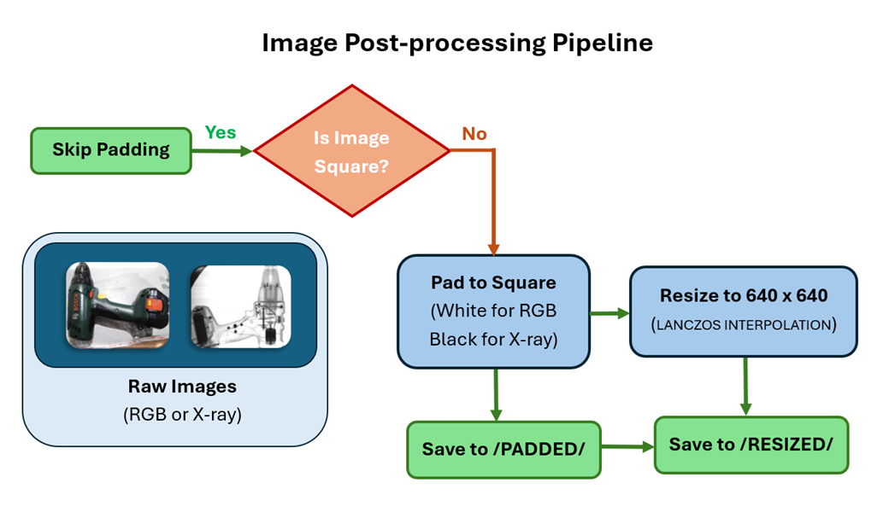

# XBAT+ Dataset Image Post-processing 

This script post-processes the RGB and X-ray images from datasets released as part of the XBAT+ project. It pads non-square images generated by the EZ-240 X-ray Scanner and Ultrasharp Camera to square dimensions and resizes them to enable direct use in AI pipelines.

  

