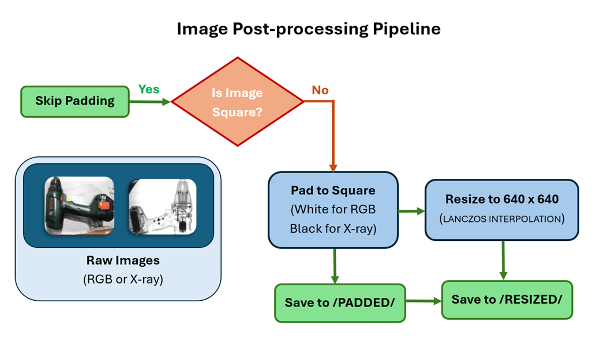

# XBAT+ Dataset Image Post-processing 

This script post-processes RGB and X-ray images for the XBAT+ 1.0 release of training and testing datasets publicly available via the Zenodo repository at https://zenodo.org/records/18022530. It pads non-square images generated by the EZ-240 X-ray scanner and the UltraSharp camera to square dimensions and resizes them to facilitate subsequent use.

  

